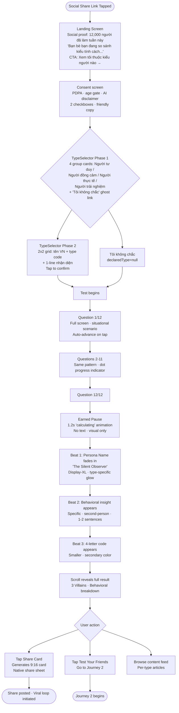
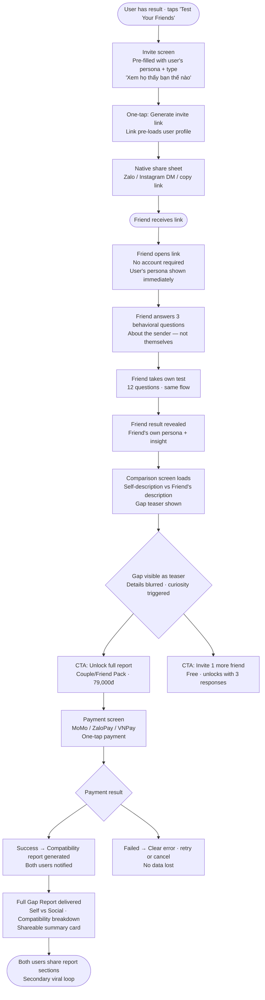
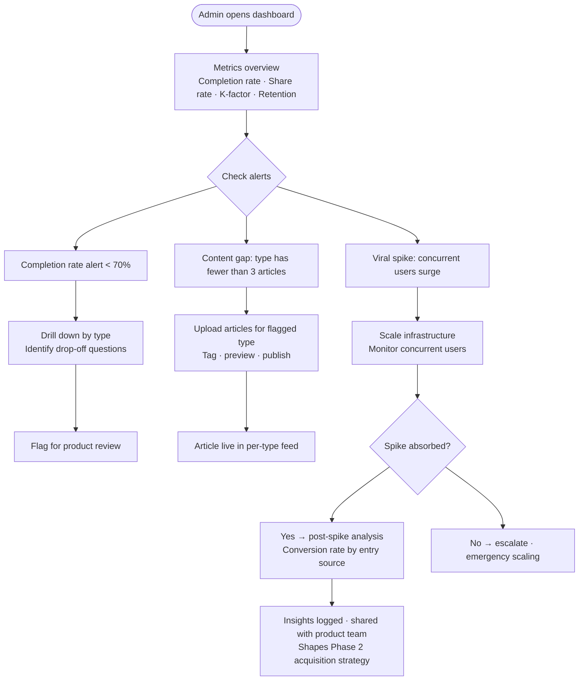

# UX Design Specification MBTI

**Author:** Thangtranit90
**Date:** 2026-04-28

---

<!-- UX design content will be appended sequentially through collaborative workflow steps -->

## Executive Summary

### Project Vision

MBTI Platform is not a personality quiz — it is an AI-powered **"living mirror"**: a self-reinforcing system that helps users understand who they are in relation to others, and how they change over time. Core philosophy: **Mirror-First, Guidance-Second** — the platform does not sell a label; it sells self-intelligence.

Target emotional response: *"ủa sao nó biết mình vậy?"* — recognition of a real behavioral pattern, not a flattering generalization. This moment drives unprompted sharing and initiates the viral acquisition loop.

### Target Users

| Persona | Profile | Usage Context |
|---|---|---|
| **Linh — Solo Explorer** | 22, marketing student, Hanoi. Instagram/TikTok-native. Arrives via a friend's Story | 10pm, mobile, fast-scroll — requires hook within the first 5 seconds |
| **Minh — Social Initiator** | 26, startup employee, in a relationship. Result resonates → wants to compare with someone close | Mid-Zalo-chat context — share must be 1 tap, zero friction |
| **Hà — Returning User** | 24, designer, HCM. Took the test, shared once, then forgot | Needs a specific social hook (named friends, not generic notification) to return |
| **Admin** | Content manager. Manages articles, tracks metrics, responds to viral spikes | Desktop, dashboard-oriented |

**Primary device:** Mobile (PWA Phase 1) — majority of entry from Instagram/TikTok Stories links.

### Key Design Challenges

1. **Zero-friction entry vs. meaningful onboarding** — No onboarding wall, but must collect PDPA consent and set correct expectations ("self-reflection tool, not clinical assessment"). UX must accomplish both within ≤2 screens.

2. **The Delight Moment architecture** — The result page is the product's heart. Design must deliver persona name *before* the 4-letter type, emotional insight *before* explanation, creating a pause-and-read moment, not a skim. Wrong sequence = lost share moment.

3. **Viral share flow** — Share card must be Stories-format (9:16), visually compelling as a screenshot, no additional steps required. Social loop invite flow must require no account — invitees only need to click a link and answer 3 behavioral questions.

4. **Self vs. Social Gap visualization** — Displaying the gap between "how you see yourself" and "how others see you" is tonally sensitive. If designed incorrectly: users feel judged rather than illuminated. Must balance curiosity vs. psychological safety.

5. **Curiosity loop architecture** — Retain users through open loops (friends just voted, gap report not yet unlocked), not forced habit mechanics or spam notifications. Design must create "need to know" rather than "being reminded."

### Design Opportunities

1. **Narrative result experience** — Result page can be designed as a "reveal scene" (storytelling format) rather than a report page. Persona name → cinematic reveal → behavioral insight → villains → share. Creates the feeling of a moment, not a webpage.

2. **Share card as hero product** — The share card is not just an output — it is the primary acquisition channel. Invest in card animations, hook copy ("3 types most likely to clash with you"), and shareable formats optimized for both Instagram Stories and Zalo.

3. **Progressive curiosity architecture** — Teaser design: reveal enough of the gap report to trigger curiosity (who voted what), withhold enough to justify upgrade or invitation. This is where UX determines the Couple/Friend Pack conversion rate.

4. **Mobile-first, instant-load philosophy** — Users arrive from a social context with a 3–5 second attention window. First meaningful paint must occur within 3 seconds. The test flow must feel like a conversation, not a form.

---

## Core User Experience

### Defining Experience

The entire product revolves around the **test flow → result reveal sequence**. This is the moment the product delivers its promise and triggers sharing. Everything else (social loop, content feed, compatibility report) flows downstream from this moment.

> "If we only nail one thing, it must be: the user reads the result and pauses — not to skim, but to absorb."

### Platform Strategy

| Dimension | Decision | Rationale |
|---|---|---|
| **Phase 1 Platform** | Mobile-first PWA (Responsive SPA) | Entry point from Instagram/TikTok Stories — users are on their phones |
| **Primary Interaction** | Touch-based | 85%+ traffic expected from mobile |
| **Desktop** | Fully supported, not primary | Admin dashboard, some compatibility report viewing |
| **Offline** | Not required for MVP | Test and result require real-time AI generation |
| **Native App** | Phase 2+ after core loop validation | PWA sufficient to validate the core loop |
| **Performance Budget** | First Meaningful Paint ≤ 3s | Users arrive from social context with short attention windows |

### Effortless Interactions

These actions must happen **zero-thought**, requiring no guidance:

1. **Starting the test** — Landing page → first question in ≤2 clicks. No account, no form, no onboarding wall.
2. **Answering questions** — Situational prompts, binary or scale selection, no typing. Each question ≤10 seconds to decide.
3. **Sharing results** — 1 tap to generate a Stories-format card. Card is ready to screenshot or share directly — no additional editing required.
4. **Inviting friends** — 1 link, invitee requires no account. They only answer 3 behavioral questions about the sender.
5. **Payment** — MoMo / ZaloPay / VNPay. Familiar payment UX. ≤30 seconds from intent to confirmation.

### Critical Success Moments

Four moments that determine the product's success or failure:

| Moment | Description | Risk if Failed |
|---|---|---|
| **The Delight Moment** | Persona name appears → behavioral insight lands → user stops and re-reads | No share, no viral loop, no traction |
| **The Share Moment** | User proactively screenshots or taps share — without explicit prompting | Viral K-factor = 0, platform does not grow |
| **The Gap Reveal** | Self-perception vs. friend's perception comparison loads — creates "wow" not "so what" | Social loop has no value, Couple Pack does not convert |
| **The Return Hook** | Specific named notification ("Minh just voted on how you behave") pulls user back | 7-day retention ≤10%, platform has no continuity |

### Experience Principles

Five principles that guide every UX decision:

1. **Speed over completeness** — Any step that adds friction before The Delight Moment is a conversion risk. Always prioritize simplicity.

2. **Conversation, not interrogation** — Test questions are natural situational prompts, not psychological assessments. Users must feel they are "telling a story," not "being evaluated."

3. **Reveal, not report** — Every result is a cinematic moment, not a data dump. Each reveal must create a beat of recognition before providing explanation.

4. **Social as product, not feature** — The invite flow and comparison mechanic are core product experiences, not add-ons. Design them with the same level of care as the test itself.

5. **Curiosity over completion** — Open loops (pending votes, locked gap report) are intentional design elements that create return motivation. Do not resolve them earlier than necessary.

---

## Desired Emotional Response

### Primary Emotional Goals

**Primary target emotion: Recognition + Delight**

Not "interesting" or "useful" — but a more specific moment: **"Uncomfortably accurate recognition"** — the feeling that a product has just described a behavior the user has never named before. The target reaction is *"ủa sao nó biết mình vậy?"* — surprise mixed with recognition, strong enough to trigger a social action (share, tag a friend, start a conversation).

**Secondary emotion: Relational curiosity**
After the delight moment, users don't just wonder about themselves — they want to know: "Do others see me this way?" This emotion pulls them into the social loop — it is not a feature gimmick, it is an emotional need the product serves.

### Emotional Journey Mapping

| Stage | Desired Emotion | Emotion to Avoid |
|---|---|---|
| **Discovery** (from friend's Story) | Mild curiosity + healthy skepticism *"will this actually be accurate?"* | Boredom, dismissal *"this is probably generic"* |
| **Entry / Consent screen** | Trust + light anticipation | Friction, annoyance, feeling tracked |
| **Reverse mechanic** *(declaring type first)* | Playful engagement, self-investment | Confusion, anxiety about right/wrong answers |
| **During test** | Absorbed, slightly self-reflective, natural | Tired, judged, pressured to answer "correctly" |
| **Result reveal** | Surprise → Recognition → Delight (in this sequence) | Disappointment, *"this is the same for everyone"* |
| **Share moment** | Pride-adjacent + desire to connect *(not vanity)* | Embarrassment, oversharing discomfort |
| **Social loop / Invite** | Curiosity about others' perception | Vulnerability anxiety, *"what does my friend think of me?"* |
| **Gap reveal** | Illuminated, seen *(not judged)* | Attacked, exposed, misunderstood |
| **Return** | Anticipation + unresolved curiosity | Obligation, FOMO, notification fatigue |
| **Paywall / Couple Pack** | Natural next step, *"I want this"* | Manipulated, pressured, pay-walled |

### Micro-Emotions

Small emotions that determine quality of experience:

| Micro-emotion | When it occurs | UX Implication |
|---|---|---|
| **Trust** | Reading an AI insight | Copy must be specific and behavioral, not generic. One false detail = total trust loss |
| **Safe vulnerability** | Sharing gap report | Tone must be *"illuminating"*, not *"exposing"*. Frame gap as self-discovery, not judgment |
| **Playful competitiveness** | Villains reveal, type clashes | Light, not toxic. *"You and ENTJs clash because..."* not *"ENTJs are your enemies"* |
| **Earned curiosity** | Open loop (votes pending, gap locked) | Lock must feel earned and natural, not manipulative. User chooses to wait or unlock — never forced |
| **Micro-accomplishment** | Completing the test | Small completion animation, not ostentatious. Transition into result must carry weight — a moment of transition |

### Design Implications

**Emotion → UX Decisions:**

1. **Recognition → Result page sequence design**
   Persona name *first*, 4-letter code *after*. Insight copy must be behavioral + specific (not "you are a sensitive person" but "you tend to stay silent in group conflicts — not because you lack opinions, but because you feel timing matters more than being right"). This is where copywriting investment is highest.

2. **Safe vulnerability → Gap visualization tone**
   Gap Report does not use "others see you as..." — instead: "in the eyes of those close to you, you tend to come across as..." Framing is perspective, not verdict. Visual design: soft contrast, no harsh highlighting.

3. **Relational curiosity → Social loop friction**
   Invite copy is not "invite your friends" — it is "Linh wants to know if you see her the way she sees herself." Make it specific, relational, personal. Friction = 0 for invitees.

4. **Natural next step → Paywall placement**
   Paywall appears *at peak curiosity*: after the gap teaser has loaded and the user can see who voted but not the details. It does not appear before the delight moment has already occurred.

5. **Trust → AI disclaimer handling**
   Disclaimer ("AI-generated for self-reflection") must be small and subtle — it must not interrupt emotional flow. Place at the bottom of the result card, not the top. One-time onboarding line is sufficient.

### Emotional Design Principles

1. **Sequence is everything** — The delight moment is destroyed by a wrong reveal order. Every animation, transition, and copy hierarchy must serve: Surprise *first* → Recognition *first* → Explanation *after*.

2. **Specific beats generic, always** — One specific insight creates more emotional impact than ten generic ones. When in doubt about copywriting: make it more specific, not broader.

3. **Illuminate, never expose** — Social and gap features have the power to create vulnerable moments. Design must always frame from the perspective of *"helping you see yourself better"*, not *"revealing what others think is wrong with you"*.

4. **Earned pauses, not loading screens** — Transition time before the result reveal is *intentional emotional architecture*, not technical latency. A brief moment of anticipation before the persona name appears amplifies recognition. Design it; do not apologize for it.

5. **Joy without pressure** — Every upsell, paywall, and CTA must feel like an invitation, not a gate. Users must feel they *want* to continue — not that they are being pushed.

---

## UX Pattern Analysis & Inspiration

### Inspiring Products Analysis

**1. Spotify Wrapped**
*Relevant because:* Same category — identity content personalized from real data, massive viral sharing, creates FOMO and anticipation. Wrapped validates the entire MBTI Platform premise: users want *data about themselves* as a story, not a report.

| UX Pattern | Why It Works | Application to MBTI |
|---|---|---|
| **Progressive story reveal** | Full-screen card-by-card reveal creates momentum and anticipation | Result page: persona → insight → villains → share — each element is its own "card" |
| **Shareable aesthetic cards** | Designed to be screenshot — every card is a social artifact | Result card must pass the "screenshot test": beautiful, readable, and intriguing out of context |
| **Personal data as identity** | "Your top 0.1% listeners" — specificity creates social currency | "The Silent Observer" + specific behavioral insight > "You are INFP" |
| **Annual ritual / FOMO** | Everyone shares at the same time, creating a social event | "3 Villains" component is MBTI's version — designed to start conversations |

---

**2. Co-Star (Zodiac app)**
*Relevant because:* Has already validated the exact same market behavior in Gen Z — social comparison, notification hooks about relationships, personality-adjacent content. Vietnam's zodiac culture + Co-Star pattern = proof of concept for the MBTI social layer.

| UX Pattern | Why It Works | Application to MBTI |
|---|---|---|
| **Named social notifications** | "You and [friend's name] are incompatible today" — highly specific, triggers curiosity | "2 friends voted on how they see [user name]" — named, not generic |
| **Relationship-first social layer** | UX built around comparing with specific people, not general followers | Test Your Friends loop: invite specific people, don't broadcast |
| **Daily micro-content** | Short, type-specific insights delivered regularly | Phase 2: Daily micro-challenge; Phase 1: per-type content feed |
| **Aesthetic over utility** | Dark, premium feel; the app feels like a personal oracle | MBTI needs a visual identity that feels like a "personal mirror," not a "quiz platform" |

---

**3. 16personalities.com**
*Direct competitor — learning from both strengths and weaknesses.*

| Pattern | What They Do Well | What MBTI Should Do Differently |
|---|---|---|
| **Test flow** | Clean, linear, distraction-free | Adopt: simple linear flow; Improve: conversational framing, not binary agree/disagree |
| **Result copywriting** | Specific enough to feel personal | Adopt: behavioral language; Improve: AI-generated specificity based on actual responses, not templates |
| **Result page design** | Full-screen, immersive, type-specific colors | Adopt: full-screen immersive; Improve: persona name reveal BEFORE the 4-letter code |
| **No social layer** | — (absent) | Core differentiation: bidirectional social comparison does not exist at any competitor |
| **No continuity** | — (absent) | Core differentiation: living mirror, not a one-time result |

---

**4. Duolingo**
*Relevant because:* Best-in-class for curiosity loops, streak mechanics, and returning users through intrinsic motivation rather than guilt.*

| UX Pattern | Why It Works | Application to MBTI |
|---|---|---|
| **Progress visualization** | Users always see how far they've come and what's ahead | Gap Report teaser: show "2/3 friends voted" — progress creates pull |
| **Streak psychology** | Loss aversion makes users reluctant to break a streak | Phase 2: Personality Streak. Phase 1: "Loop status" (N friends responded) |
| **Celebration moments** | Over-the-top celebration at milestone completion | Result reveal transition: do not skip; build in an intentional "earned pause" |
| **Zero-friction re-entry** | Deep link directly to needed content, not the homepage | Return notifications deep-link straight to gap status, not the feed |

---

### Transferable UX Patterns

**Navigation Patterns:**
- **Card-based progressive reveal** *(from Wrapped)* — Apply to result flow: each element of the result is a full-screen moment, not a long-scroll page
- **Bottom sheet for secondary actions** *(mobile standard)* — Share options, invite options appear from the bottom without interrupting main content
- **One-screen-one-job** *(Duolingo)* — Each screen in the test flow contains exactly one question; no sidebar or navigation noise

**Interaction Patterns:**
- **Tap-to-reveal** *(Wrapped)* — Persona name can animate in when the user taps, creating active participation in the reveal moment
- **Swipe between states** — In gap visualization, swipe between "how you see yourself" and "how others see you"
- **Share sheet as first-class UI** *(Instagram)* — Do not hide the share action in a menu; place it prominently immediately after the result reveal

**Visual Patterns:**
- **Full-bleed type-specific color** *(16personalities)* — Each MBTI type has its own color, consistent across result card, share card, and content feed
- **Large typography for emotional impact** *(Spotify Wrapped)* — Persona name must dominate the screen. 48px+ not 24px
- **Subtle gradient overlays** *(Co-Star aesthetic)* — Creates a premium feel; avoid flat white backgrounds for result pages

### Anti-Patterns to Avoid

1. **Onboarding wall before delivering value** *(Facebook, many apps)* — Do not require account creation before the test. Value first; registration optional (and only when there is a compelling reason).

2. **Buzzfeed-style quiz aesthetics** — "Which MBTI type are you? Take this 5-minute quiz!" framing destroys trust and credibility immediately. Visual language and copy must feel substantive, not cheap.

3. **Paywall before the delight moment** — Any upsell that appears before the user has experienced the "uncomfortably accurate" moment is wrong timing. Users must already trust the product before being asked to pay.

4. **Generic "share your result" CTA** — A plain "Share with friends" button does not convert. Specific social hooks are required: "Tag someone who needs to see this" or "See if [type] describes you too."

5. **Infinite scroll content feed as primary retention** — TikTok/Instagram patterns do not work for a personality platform. The content feed is layer 2; the social loop is the primary retention driver. These two must not be conflated in the design.

6. **Push notification permission prompt in the first session** — Requesting notification permissions within the first 5 minutes is a UX anti-pattern. Trigger only after the user has experienced the social loop.

### Design Inspiration Strategy

**Adopt directly:**
- Spotify Wrapped's **progressive full-screen card reveal** → Result page architecture
- Duolingo's **deep-link return notifications** → Social hook notifications that link directly to gap status
- Instagram Stories' **9:16 share card format** → Share card dimensions and aesthetic

**Adapt for MBTI context:**
- Co-Star's **named social notifications** → Personalize with friend names and specific actions ("voted on how you behave"), not relationship type
- 16personalities' **type-specific color system** → Extend to persona names and behavioral language, not just UI color
- Duolingo's **progress visualization** → Apply to social loop status (N/3 friends responded), not test progress (which is an anxiety trigger)

**Avoid entirely:**
- Any visual or copy pattern reminiscent of Buzzfeed quiz culture
- Forced account creation before result delivery
- Premature monetization before trust is established

---

## Design System Foundation

### Design System Choice

**Selection: Tailwind CSS + Shadcn/ui + Framer Motion**

This is **Approach 3 (Themeable System)** — using a utility-first approach rather than a component-library-first approach.

### Rationale for Selection

**Why NOT Material Design / Ant Design:**
- Material Design reads as "Google / utilitarian" — the opposite of the premium, personal-mirror aesthetic MBTI requires
- Ant Design is business-oriented; unsuitable for a Gen Z emotional product
- Both are extremely difficult to de-brand — more time is spent fighting the library than building the product

**Why Tailwind CSS is the right foundation:**

| Requirement | How Tailwind Addresses It |
|---|---|
| **Premium, unique aesthetic** | Utility-first = no "library look". UI appears fully custom |
| **16 MBTI type-specific colors** | CSS variables / design tokens system — define 16 palettes once, use everywhere |
| **Mobile-first** | Built-in responsive prefixes (`sm:`, `md:`, `lg:`) in mobile-first order |
| **Full-screen animations** | Works seamlessly with Framer Motion — no conflicts |
| **Fast MVP development** | Rapid iteration without writing custom CSS files |
| **Vietnam dev community** | Tailwind is the most widely used framework in Vietnam's dev community — easy to hire for |

**Why Shadcn/ui for component primitives:**
- Not a component library — a collection of copy-pasteable, accessible components built on Radix UI
- Full code ownership: components are copied into the project, fully customizable
- Accessibility built-in (keyboard navigation, ARIA) without separate effort
- Works seamlessly with Tailwind
- Used for: form elements in test flow, bottom sheets, modals, dropdowns

**Why Framer Motion for animations:**
- Best-in-class animation library for React/web
- The result reveal sequence requires: page transitions, element stagger, tap-to-reveal — all handled well by Framer Motion
- Declarative animation syntax = easy to iterate and refine the emotional quality of transitions

### Implementation Approach

**Layer 1 — Foundation:**
```
Tailwind CSS (styling)
  ├── Custom design tokens (16 type palettes, typography scale, spacing)
  └── Mobile-first responsive breakpoints
```

**Layer 2 — Component Primitives:**
```
Shadcn/ui + Radix UI (accessible components)
  ├── Form elements (test question choices)
  ├── Bottom sheets (share options, invite actions)
  ├── Progress indicators (loop status)
  └── Dialog/Modal (paywall, compatibility report)
```

**Layer 3 — Motion & Transitions:**
```
Framer Motion (animations)
  ├── Result reveal sequence (persona → insight → villains)
  ├── Page transitions (test flow card-by-card)
  ├── Share card generation animation
  └── Gap visualization state transitions
```

### Customization Strategy

**Design tokens to define before building:**

1. **16 MBTI Type Palettes** — Each type has: primary color, secondary color, gradient (used for full-bleed result pages and share cards)

2. **Typography Scale:**
   - Display (64px+): Persona name reveal
   - Headline (32–48px): Key insights
   - Body (16–18px): Behavioral descriptions
   - Caption (12–14px): Disclaimers, secondary info

3. **Spacing System** — 4px base grid, consistent across all components

4. **Motion Tokens:**
   - `reveal-entrance`: 600ms ease-out (persona name appears)
   - `card-transition`: 300ms ease-in-out (swipe between cards)
   - `earned-pause`: 1200ms intentional delay before result reveal (emotional architecture, not loading)

5. **Bespoke Components** (custom — not from library):
   - Result Card (full-screen, type-specific gradient)
   - Share Card (9:16 format, Stories-optimized)
   - Test Question Card (conversational layout)
   - Gap Visualization (self vs social comparison)
   - Loop Status Indicator (N/3 friends responded)

---

## Design Direction Decision

### Design Directions Explored

Six directions were explored, each representing a distinct visual approach:

1. **The Oracle** — Dark, atmospheric, indigo accent; Co-Star-inspired
2. **The Journal** — Light, editorial, warm cream; text-first credibility
3. **The App** — Clean consumer app; familiar patterns, broad appeal
4. **The Stage** — Near-black with vivid type-specific accent; theatrical, bold *(selected)*
5. **The Mirror** — Minimal, typographic-only; restraint as premium signal
6. **The Social** — Warm amber, social proof forward; community-first energy

### Chosen Direction

**Direction 4 — "The Stage"**

Near-black base (`#050507`) with the user's MBTI type-specific accent color as the dominant visual element. The UI has minimal chrome — large, bold typography, significant whitespace, and a single vivid accent that varies per type. Theatrical and memorable; designed to feel like a personal reveal event, not a quiz platform.

### Design Rationale

1. **Share-ability is highest** — Near-black + vivid accent is the most distinctive pattern in a social feed. Screenshots from this direction stand out on Instagram Stories and Zalo, which is critical since the share card IS the primary acquisition channel.

2. **Gen Z Vietnam fit** — The "Stage" aesthetic reads like a drop, a limited release, or a concert event — cultural touchpoints that resonate with the 18–28 target demographic. It signals "this is not another BuzzFeed quiz."

3. **Type-specific color system activates naturally** — Each of 16 MBTI types gets its own accent color on the result page. This creates immediate, visual personalization — users' results *look* different from each other, increasing social conversation when friends compare.

4. **Emotional architecture works** — The dark, quiet background gives the persona name and behavioral insight maximum visual weight. The delight moment ("The Silent Observer" appearing in large type against near-black) is more cinematically impactful than any other direction.

5. **Low UX noise** — Minimal chrome means users are never distracted from the content. Test questions are legible, the result reveal is focused, and CTAs are unambiguous.

### Implementation Approach

**Entry screen:** Near-black with a type-specific color "glow" radial gradient. Headline in large bold white text. Single universal CTA (amber, before type is known).

**Test flow:** Near-black background. Large numbered question counter in very dark gray (decorative). Question text in white at 20px+. Answer options as dark-bordered cards that activate with type-specific color on selection.

**Result reveal:** Full-screen near-black. Type-specific color glow emanates from top-right. Persona name in 36–40px bold white. 4-letter code in secondary muted color. A short horizontal rule in type-specific color separates name from insight. Behavioral insight in muted slate. Two CTAs at bottom.

**Share card (9:16):** Replicates the result reveal composition — near-black background, type-specific glow, persona name dominant. Designed to be screenshot-ready as-is; no crop or adjustment needed for Stories format.

---

## 2. Core User Experience

### 2.1 Defining Experience

**"The Mirror Reveal" — Test ends → The mirror appears**

This is MBTI's defining experience:

> *The user completes 12 questions → the screen transitions → a persona name appears → a single line of insight accurately describes a behavior they have never named → they stop and re-read → screenshot → share.*

Equivalent in other products:
- Tinder: *"Swipe to match"*
- Spotify Wrapped: *"See your year in music"*
- **MBTI: *"Answer 12 questions → receive a mirror that knows you"***

What makes this experience **defining** is not the test — it is the moment of **recognition** after the test. The test is the vehicle. The mirror reveal is the product.

### 2.2 User Mental Model

**Mental model users bring in:**
Users arrive with expectations from 16personalities and BuzzFeed quizzes: *"I'll answer some questions → get INFP/ENTJ → read a generic description of that type."*

**Where expectations are subverted (by design):**

| Expectation | MBTI Reality | Effect |
|---|---|---|
| *"There will be many questions"* | 12 questions, 4–5 minutes | Positive surprise: *"that's it?"* |
| *"The result is 4 letters"* | Persona name appears first | Curiosity: *"What is 'The Silent Observer'?"* |
| *"Generic description"* | Behavioral insight specific to responses | Recognition: *"how does it know?"* |
| *"I already know I'm INFJ"* | Reverse mechanic challenges or confirms | Investment: *"let's see if it's right"* |

**Confusion points the design must address:**
- *"What if I declared the wrong type?"* → Onboarding line: "No right or wrong — only honest answers"
- *"Is this result actually accurate?"* → The specificity of the insight answers this question on its own
- *"What is Test Your Friends?"* → Social loop CTA must appear after the delight moment, not before

### 2.3 Success Criteria

**The core experience is considered successful when:**

| Signal | Target | Measurement |
|---|---|---|
| User reads the insight at least twice | Implied by time-on-result > 30 seconds | Session analytics |
| Screenshot or share occurs within 90 seconds of result reveal | Share rate ≥ 30% in first session | Share button tap / native share API |
| User sends invite link to at least 1 person in the first session | Invite creation rate ≥ 15% | Link generation events |
| No user immediately bounces from the result page | Result bounce rate < 20% | Page exit events |

**"This just works" feeling comes from:**
- Persona name reveal requires no explanation — it generates curiosity on its own
- Behavioral insight self-validates — users do not need to be convinced it is accurate
- Share action is immediately accessible — no searching required

### 2.4 Novel UX Patterns

**Novel (requires light user education):**

1. **Reverse Test Mechanic** — Declare expected type before the test begins. Unfamiliar but self-explanatory: the prompt is clear and engaging enough for immediate uptake. Education: the prompt text itself is the "onboarding" — *"Before we start — what type do you think you are?"*

2. **Bidirectional Social Perception** — Invite friends to describe you, not just share your result. Novel but uses a familiar metaphor: *"Test Your Friends"* — the name communicates the mechanic.

3. **Persona Before Type Code** — "The Silent Observer" before "INFP". Breaks established expectations. Requires zero education because natural curiosity pulls users forward.

**Established (leveraging existing mental models):**

1. **Card-based quiz flow** — Users are already familiar with quiz interfaces: one question per screen, tap to answer. No explanation needed.

2. **Stories-format share card** — Instagram/TikTok-native users already understand 9:16 format. The share card feels immediately familiar.

3. **Social link sharing** — "Copy link + paste to Zalo" is fully established behavior in the Vietnam market.

**Novel patterns mapped to familiar metaphors:**
- Social loop: framed as *"Test Your Friends"* (game-like) not *"Social Perception Analysis"* (clinical)
- Gap Report: framed as *"See how others see you"* (relatable curiosity) not *"Perception Discrepancy Report"* (academic)

### 2.5 Experience Mechanics

**The Mirror Reveal — Step by Step:**

**Phase 1: Initiation (Test Entry)**
- *Trigger:* User arrives from a social share link (Story, Zalo) or direct URL
- *First screen:* Not a homepage — immediately the product hook. Structure:
  - **Social proof ticker** (top, 13px Inter, slate-500, subtle pulse animation): *"Hơn 12,000 người tại Việt Nam đã làm bài này tuần này"*
  - **Headline** (64px Clash Display, white, 3 lines): *"Bạn bè bạn đang so sánh / kiểu tính cách với nhau. / Bạn chưa có kết quả."*
  - **Subtext** (16px Inter, slate-400): *"Không phải trắc nghiệm. Không có kiểu người đúng hay sai. Chỉ có một tấm gương — chính xác đến mức khó chịu."*
  - **CTA primary** (indigo `#6366F1`, full-width, 48px): *"Xem tôi thuộc kiểu người nào →"*
  - **Micro-copy** below CTA (13px, slate-500): *"Miễn phí · Không cần đăng ký · Kết quả ngay"*
- *Pre-test:* Reverse mechanic prompt + 2-checkbox consent (PDPA + age gate)
- *No account wall.* User begins the test immediately.

**Phase 2: Interaction (Test Flow)**
- *Mechanic:* 12 situational questions, one per full screen
- *Format:* Scenario text + 2–4 response options (tap to select, auto-advance)
- *No back button during test* — prevents overthinking
- *Progress indicator:* Subtle dot pagination (12 dots) — shows completion, not question number
- *System response:* Instant visual feedback on tap (selected state), smooth transition to next card

**Phase 3: Earned Pause (Transition to Result)**
- *After question 12:* "Calculating" animation — 1.2 seconds intentional pause
- *Not a loading spinner* — a visual "thinking" sequence (personality type elements forming)
- *Purpose:* Build anticipation; the pause is emotional architecture, not technical latency
- *Copy during pause:* None. Let the visual breathe.

**Phase 4: Reveal Sequence (The Mirror)**
- *Beat 1:* Persona name fades in — large display typography, type-specific color
  - Example: *"The Silent Observer"*
- *Beat 2:* One-line behavioral insight appears below — specific, second-person
  - Example: *"You usually see everything before you speak — but sometimes you hold back so long that the moment passes."*
- *Beat 3:* Subtle 4-letter type appears — smaller, secondary
  - Example: *"INFP"*
- *Beat 4:* Scroll reveals 3 Villains section + full behavioral breakdown
- *Feedback mechanism:* No explicit "did we get it right?" prompt — share rate is the feedback signal

**Phase 5: Social Activation (Share + Invite)**
- *Share CTA:* Prominent, appears after 3 Villains section — *"Share your result"*
- *Share flow:* Generates Stories-format card (9:16) → native share sheet opens
- *Invite CTA:* Secondary, below share — *"Test Your Friends — see how they see you"*
- *One-tap invite:* Generates a pre-filled link with the user's type embedded
- *Completion state:* After share/invite, the result page persists — user can return and continue exploring

---

## User Journey Flows

### Journey 1: Solo Explorer — "The Mirror Reveal" (Linh)

**Entry:** Instagram/TikTok Story share link → Landing page



**Critical UX decisions:**
- Landing screen is NOT a homepage — it's the product hook. No nav, no menu.
- Reverse mechanic is pre-test, not a form — it's a playful prompt that creates investment.
- No back button during test to prevent overthinking.
- Earned pause is architectural, not a spinner — do not show loading indicator.
- Share card generates in background during result scroll, ready instantly when tapped.

---

### Journey 2: Social Initiator — "The Viral Loop" (Minh)

**Entry:** From result page → "Test Your Friends" CTA



**Critical UX decisions:**
- Friend link works with zero friction — no account, no app install required.
- 3 behavioral questions about sender must feel like a game, not a survey.
- Gap teaser shows *enough* to create curiosity, *hides enough* to justify unlock.
- Paywall appears at peak curiosity — after comparison loads, not before.
- Payment must complete in <30 seconds (MoMo/ZaloPay one-tap UX).

---

### Journey 3: Returning User — "The Open Loop" (Hà)

**Entry:** Push notification → deep link into gap status

```mermaid
flowchart TD
    A([Named notification received\n'2 người vừa vote về cách bạn hành xử']) --> B[Deep link opens\nDirectly to Gap Status screen\nNot to home feed]

    B --> C[Gap Status screen\nN friends responded · names visible\nDetails blurred — teaser only]
    C --> D{User decision}

    D --> E[View teaser\nSee who voted · general direction\nNot specific answers]
    D --> F[Invite more friends\nCopy link · Zalo share\nFree unlock at 3 responses]
    D --> G[Unlock Gap Report\nPaid · 79,000đ or bundled]

    E --> H{Enough curiosity built?}
    H --> I[Tap Unlock → payment flow]
    H --> J[Browse content feed\nType-specific articles]

    F --> K[Friend completes 3 questions]
    K --> L{3 responses collected?}
    L --> M[Yes → Gap Report unlocks free]
    L --> N[No → loop status updates\nAnother named notification queued]

    J --> O[Article: type-specific insight\nShareable · 3 min read]
    O --> P{User shares article?}
    P --> Q[Share to Zalo/IG\nSecondary viral loop])
    P --> R[Bookmark · return signal]

    M --> S([Gap Report available\nHighest retention moment])
    I --> S
```

**Critical UX decisions:**
- Deep link bypasses home — notification promises specific content, delivers immediately.
- Gap status shows progress as "2/3 responded" (near-win framing), not "1 left."
- Two free paths exist: invite 1 more friend OR pay to unlock — user always has agency.
- Content feed is secondary; never push it above the gap status screen.
- Notifications must name a specific person — generic reminders are ignored.

---

### Journey 4: Admin — Operations Flow

**Entry:** Direct dashboard access (desktop browser)



---

### Journey Patterns

**Navigation Patterns:**
- **Deep-link first** — Every re-entry point bypasses homepage and lands on the specific content promised. Never send users to a generic landing.
- **Linear with no back during test** — Prevents second-guessing. Post-result, full back navigation is available.
- **Bottom sheet for overlays** — Share options, payment, invite generation appear from bottom sheet — preserves user's current context.

**Decision Patterns:**
- **Two-path optionality at paywalls** — Always offer both a free path (invite more friends) and a paid path (unlock now). Users who feel trapped disengage; users who see a free alternative feel respected.
- **Social hook before payment hook** — Invite CTA always appears before payment CTA. Users who've already invited friends are more likely to convert.

**Feedback Patterns:**
- **Progress as near-win** — "2/3 friends responded" not "1 friend left." Near-win framing drives action more than deficit framing.
- **Named actors in all notifications** — "Minh vừa vote..." not "You have new activity." Named notifications have significantly higher open rates.
- **Instant share-card availability** — Card generates in background during result scroll, never blocking the user when they tap Share.

### Flow Optimization Principles

1. **Every screen earns its existence** — If a screen can be collapsed without losing clarity, collapse it. Zero unnecessary screens between social share link and delight moment.

2. **Errors are rare; design for them simply** — Payment failure, link expiry, and network errors each have a single-action recovery. No multi-step error flows.

3. **Progressive commitment** — Smallest action first (tap to answer), then medium (share result), then paid (unlock report). Never invert this order.

4. **Thumb-reachable primary actions** — All primary CTAs are in the bottom 60% of the mobile screen. No critical action requires reaching to the top half.

---

## Component Strategy

### Design System Components

**Available from Shadcn/ui (used directly, styling customized):**

| Component | Usage in MBTI |
|---|---|
| `Button` | CTAs: "Bắt đầu", "Chia sẻ", "Mở khóa" |
| `Sheet` (Bottom Sheet) | Share options, invite actions, payment options |
| `Dialog` | Payment confirmation, Gap Report paywall |
| `Checkbox` | PDPA consent on entry screen |
| `Separator` | Dividers between result sections |
| `Badge` | Type labels, "AI-generated" disclaimer tag |
| `Avatar` | Friend initials in Loop Status |
| `Toast/Sonner` | Success states: share confirmed, payment success |

**NOT used from Shadcn/ui** (would impose wrong aesthetic on The Stage direction): Card component, Input components, Navigation components.

### Custom Components

**7 bespoke components required — all built with Tailwind + Framer Motion:**

#### QuestionCard

**Purpose:** Delivers one test question per full screen, situational format, auto-advances on answer selection.

**Anatomy:** Progress dots (12 dots) · Optional scenario context (italic, secondary color) · Question text (20px bold white) · 2–4 answer options (tappable cards)

**States:**
- `default` — Question visible, no option selected
- `option-selected` — Selected option highlights with indigo accent; 300ms delay then auto-advances
- `transitioning` — Current card slides left, next card slides in from right (Framer Motion)

**Key interaction:** Tap to select → visual feedback (150ms) → auto-advance (300ms) → next question. No manual "Next" button.

**Accessibility:** Each option has `role="radio"`, `aria-checked`, keyboard-navigable with arrow keys + Enter.

---

#### TypeSelector

**Purpose:** Reverse mechanic — user declares expected MBTI type before test begins. Redesigned as two-phase flow to eliminate prior-knowledge requirement.

**Headline copy:** *"Trước khi bắt đầu — bạn hay bị nhận xét là người như thế nào?"* (22px Inter, white, conversational — not Clash Display)

**Sub-copy:** *"Không cần chắc chắn. Kết quả sẽ cho bạn thấy mình đoán đúng hay sai."* (14px, slate-400)

---

**Phase 1 — Group Selection (4 full-width cards):**

Each card shows: group icon + Vietnamese group name (18px bold) + group descriptor (14px, slate-400) + type codes (12px, slate-600)

| Group (EN) | Group (VN) | Descriptor | Types shown |
|---|---|---|---|
| Analysts | Người tư duy | Phân tích, logic, chiến lược | INTJ · INTP · ENTJ · ENTP |
| Diplomats | Người đồng cảm | Giá trị, kết nối, ý nghĩa | INFJ · INFP · ENFJ · ENFP |
| Sentinels | Người thực tế | Trách nhiệm, trật tự, đáng tin | ISTJ · ISFJ · ESTJ · ESFJ |
| Explorers | Người trải nghiệm | Tự do, linh hoạt, hành động | ISTP · ISFP · ESTP · ESFP |

Below all 4 cards — Ghost tier button: *"Tôi không chắc — bỏ qua bước này →"* (14px, slate-500, underline, center)

**Phase 1 interaction:** Tap group card → slide-right transition to Phase 2 for that group. No selection state needed on group cards — tap = navigate.

---

**Phase 2 — Type Selection within group (2×2 grid, slide-in from right):**

Header: back arrow (`←`) + Vietnamese group name + 4-dot progress indicator (current group highlighted)

Each type card (2 per row) shows:
- Type code (14px, letter-spaced, type-specific accent color) — top-left
- Vietnamese type name (16px Inter bold, white)
- Thin horizontal rule (type-specific accent)
- 1-line recognition phrase (13px, slate-400)

**Full 16-type mapping:**

| Type | Tên tiếng Việt | 1-line nhận diện |
|---|---|---|
| INTJ | Chiến lược gia | Luôn có kế hoạch dài hạn trong đầu |
| INTP | Nhà tư duy | Thích phân tích mọi thứ đến tận gốc rễ |
| ENTJ | Người lãnh đạo | Nhìn thấy đích đến rõ hơn cả nhóm |
| ENTP | Người tranh biện | Thích lật ngược vấn đề để tìm góc nhìn mới |
| INFJ | Người tiên tri | Hiểu người khác sâu hơn họ hiểu bản thân |
| INFP | Người mộng mơ | Sống theo giá trị cá nhân, không theo quy tắc |
| ENFJ | Người truyền cảm hứng | Kéo mọi người về phía tốt hơn một cách tự nhiên |
| ENFP | Người nhiệt huyết | Có ý tưởng cho mọi thứ — và không bao giờ hết |
| ISTJ | Người gìn giữ | Làm đúng, làm chắc — không cần ai nhắc |
| ISFJ | Người bảo hộ | Nhớ hết điều quan trọng với người mình thương |
| ESTJ | Người tổ chức | Ai cần quản lý dự án hoặc sự kiện thì tìm họ |
| ESFJ | Người chăm sóc | Hạnh phúc nhất khi mọi người xung quanh đều ổn |
| ISTP | Người thực chiến | Học nhanh nhất khi tự tay làm — không cần hướng dẫn |
| ISFP | Người nghệ sĩ | Cảm nhận nhiều, nói ít — nhưng làm đẹp mọi thứ |
| ESTP | Người hành động | Không thích kế hoạch dài, thích bắt tay làm ngay |
| ESFP | Người vui sống | Ở đâu có họ, ở đó có năng lượng và tiếng cười |

**Phase 2 interaction:** Tap type card → highlight border (type-specific accent, 150ms) → scale pulse (300ms) → store type in Zustand → navigate to `/test`. No Confirm button. Back (`←`) returns to Phase 1.

**States (Phase 2):** `default` · `selected` (border + accent glow, others dim to 40% opacity) · `confirmed` (scale animation 300ms → navigate)

**"Tôi không chắc" behavior:**
- Stores `declaredType: null` in Zustand `useTestStore`
- Navigates directly to `/test` — skips Phase 2 entirely
- Result page: `ReverseReveal` section is hidden when `declaredType === null`; no penalty, no messaging about skipping

**Accessibility:** Phase 1 — `role="radiogroup"` on group list, `role="radio"` per group card. Phase 2 — nested `role="radiogroup"` per group, `role="radio"` per type card. "Tôi không chắc" is `role="button"`. `aria-label` on each type card: *"{Vietnamese name} — {type code}: {1-line description}"*.

---

#### EarnedPauseTransition

**Purpose:** 1.2-second intentional pause between test completion and result reveal. Emotional architecture, not a loading spinner.

**Anatomy:** Full-screen near-black · Animated visual: particles coalescing into a shape · No text, no progress bar, no skip option

**States:** `animating` (0–900ms) → `resolving` (900–1200ms, glow intensifies) → `complete` (transitions to ResultCard)

**Duration:** Hardcoded at 1200ms. Not user-skippable.

---

#### ResultCard

**Purpose:** The Mirror Reveal — the product's most critical component.

**Anatomy:** Full-screen near-black · Type-specific color radial glow (top-right) · Persona name (64px Clash Display) · Behavioral insight (16px Inter, slate-400) · 4-letter type code (14px, letter-spaced) · Horizontal rule in type-specific accent · Scroll indicator

**Reveal sequence (Framer Motion):**
- Beat 1: 0ms delay, 600ms fade-in — Persona name
- Beat 2: 800ms delay, 400ms slide-up + fade — Behavioral insight
- Beat 3: 1400ms delay, 300ms fade-in — Type code + divider
- Scroll reveal: 2000ms delay — Chevron pulses

**Variants:** 16 type-specific color themes via CSS custom properties (`--type-accent`, `--type-gradient-start`, `--type-gradient-end`)

**Accessibility:** Persona name has `role="heading"` `aria-level="1"`. Full result text available as readable block for screen readers independent of staged visual reveal.

---

#### ShareCard

**Purpose:** 9:16 Stories-format card, generated as a static image for native share. The primary viral acquisition artifact.

**Anatomy:** 1080×1920px canvas (rendered via `@html-to-image`) · Near-black + type-specific glow · Platform logo (top-left) · Persona name (dominant, center) · 1-line insight teaser · Type code (bottom) · Social hook text (e.g., "3 types most likely to clash with me →")

**States:** `generating` (spinner on Share button) · `ready` (native share sheet opens) · `fallback` (plain text URL if generation fails)

**Key behavior:** Begins rendering in background when user scrolls past Beat 3 — card is ready before user taps Share.

---

#### GapVisualization

**Purpose:** Self-perception vs. friend-perceived gap — the core social comparison mechanic.

**Anatomy:** Two-panel horizontal layout · Left: "Bạn thấy bạn" · Right: "Người thân thấy bạn" · 3 behavioral descriptor tags per panel · Blur overlay on right panel in teaser state

**States:** `teaser` (right panel blurred, lock icon, unlock CTA) · `partial-unlock` (some right panel visible) · `unlocked` (full comparison, no overlay) · `empty` (invite CTA)

**Interaction:** Swipe between panels for full-screen view of each side on mobile.

---

#### LoopStatus

**Purpose:** Shows social loop progress — who has voted, how many remain, and next actions.

**Anatomy:** Friend avatars row (initials + color) · Progress text "2/3 người đã vote" · Thin progress bar · Two CTAs: "Mời thêm người" (free) + "Mở khóa ngay" (paid)

**States:** `empty` · `partial` (1–2 responses) · `threshold-met` (3 responses, auto-unlocks) · `unlocked`

**Accessibility:** Progress conveyed via `aria-label="2 of 3 friends have responded"`.

### Component Implementation Strategy

All custom components consume Tailwind design tokens — no hardcoded hex values. Type-specific colors injected via CSS custom properties at page level (`data-type="INFP"`) so one component definition supports all 16 type themes.

### Implementation Roadmap

| Phase | Component | Journey | Priority |
|---|---|---|---|
| **1 — Core MVP** | QuestionCard | All test flows | Critical |
| **1 — Core MVP** | TypeSelector | Entry (reverse mechanic) | Critical |
| **1 — Core MVP** | EarnedPauseTransition | Test → Result | Critical |
| **1 — Core MVP** | ResultCard | Result reveal | Critical |
| **1 — Core MVP** | ShareCard | Share + viral loop | Critical |
| **2 — Social Loop** | GapVisualization | Viral loop + return | High |
| **2 — Social Loop** | LoopStatus | Return + social loop | High |
| **3 — Content + Admin** | ContentArticleCard | Return / content feed | Medium |
| **3 — Content + Admin** | Admin dashboard widgets | Operations | Low |

---

## UX Consistency Patterns

### Button Hierarchy

**3-tier hierarchy:**

| Tier | Visual | Usage | Example |
|---|---|---|---|
| **Primary** | Filled · indigo `#6366F1` · full-width on mobile | One per screen · most important action | "Bắt đầu", "Mở khóa", "Thanh toán" |
| **Secondary** | Outlined · border `#1e2a3a` | Supporting action alongside primary | "Mời thêm người" (when "Mở khóa" is primary) |
| **Ghost / Text** | No border · no background · underline or arrow | Least important · escape path | "Test Your Friends →", "Bỏ qua" |

**Rules:** Maximum 1 primary button per screen. Full-width on mobile, max 480px on desktop. Min height 48px. Disabled state: 40% opacity + `aria-disabled="true"`. Loading state: label replaced with spinner, width locked to prevent layout shift.

### Feedback Patterns

**Toast notifications (Sonner) — position: bottom, above safe area inset:**

| Type | Trigger | Duration | Visual |
|---|---|---|---|
| `success` | Share complete, payment success, link copied | 3s | Green left border |
| `info` | Link generated, friend joined loop | 4s | Indigo left border |
| `error` | Payment failed, network error | Persistent + dismiss | Red left border + retry action |

**Inline feedback (no toast):** Answer selection, checkbox, progress dots — all immediate, no toast.

**Empty states:**

| Screen | Message | CTA |
|---|---|---|
| Loop Status (0 friends) | "Chưa có ai vote" | "Mời bạn bè ngay" (primary) |
| Content Feed (no articles for type) | "Đang cập nhật nội dung..." | None |

**Loading states:** EarnedPauseTransition (custom 1200ms animation) · ShareCard generation (spinner on button, <500ms) · AI result generation (skeleton beats, max 3s) · Payment (full-screen overlay, blocks interaction).

### Form Patterns

MBTI Platform has minimal forms by design — only 3 form interactions in core MVP:

1. **Consent Checkbox** — Single checkbox; "Bắt đầu" disabled until checked; inline red text error (no toast) if user attempts to proceed unchecked.
2. **TypeSelector** — Grid of radio buttons; no validation needed; single selection.
3. **Payment** — Handled entirely by third-party SDK (MoMo/ZaloPay/VNPay); MBTI provides context screen only; never collects card numbers directly.

### Navigation Patterns

**Core principle: No persistent navigation in primary user flows.**

**Linear flow (Entry → Test → Result):** No header nav, no back button during test. Progress dots are the only spatial cue.

**Back navigation rules:**

| From Screen | Back Available? | Destination |
|---|---|---|
| Test Q2-12 | NO — locked | — |
| Earned pause | NO — transition | — |
| Result reveal | NO — one-way | — |
| Result (expanded) | Yes — scroll to top | Result top |
| Gap Status | Yes | Result |
| Payment | Yes — abandon | Gap Status |
| Content article | Yes | Content feed |

**Deep-link return:** Notifications land on specific screen directly. Back button (`←`) top-left: one level up, never exits app.

### Overlay Patterns

**Bottom Sheet:** Share options, invite generation, type filter. Height: auto up to 80vh. Drag handle visible. Backdrop tap dismisses. `Escape` key dismisses.

**Modal Dialog:** Payment confirmation. Max width 360px. Always has explicit `×` close button. Cannot dismiss by backdrop tap during payment flow.

**Paywall overlay:** Blur applied directly to gated content (GapVisualization), not a modal. CTA centered over blur. Two dismiss paths: invite friends (free) or pay.

### Loading & Skeleton States

**Skeleton screens** for content (not spinners): Result page AI generation >1s · Content feed articles during load.

**Spinners** only for user-initiated actions: Share button · Payment processing overlay.

**Progress indicators:** Dot pagination for test (12 dots, not % bar) · Thin accent bar for loop status (N/3 friends).

### Micro-interaction Standards

| Interaction | Animation | Duration |
|---|---|---|
| Option tap in test | Border highlight + background tint | 150ms CSS |
| Auto-advance between questions | Slide left / right | 300ms Framer Motion |
| Result beat reveals | Fade-in + translate-up | 400–600ms Framer Motion |
| Button press | Scale 0.97 | 100ms CSS |
| Bottom sheet open | Slide up | 250ms Shadcn built-in |
| Toast appearance | Slide up + fade | 200ms Sonner built-in |

**Motion budget:** Total animation on any single screen transition ≤ 600ms.

**`prefers-reduced-motion`:** All Framer Motion animations respect this via `useReducedMotion()` — falls back to instant state changes. EarnedPauseTransition still delays 1200ms but shows plain dark screen with glow only (no particle animation).

---

## Responsive Design & Accessibility

### Responsive Strategy

**Philosophy: Mobile-native, desktop-graceful.**

Core flows (test, result reveal, social loop) are designed for mobile as the primary canvas. Desktop is supported fully but the experience is intentionally app-like — centered column, dark flanks — not a wide-layout website.

| Breakpoint | Range | Strategy |
|---|---|---|
| **Mobile** | 0–479px | Single column, full-width, bottom-anchored CTAs, native share |
| **Mobile-L** | 480–767px | Same layout, minor typography scale-up, more breathing room |
| **Tablet** | 768–1023px | Core flows: 480px centered; content feed: 2-column; GapViz: side-by-side |
| **Desktop** | 1024px+ | Core flows: 480px centered column; dark background fills remaining width; admin: full-width multi-column |

### Breakpoint Strategy

**Tailwind breakpoints (mobile-first):**

```
Default (0px+):    Mobile — single column, full-width
sm: (480px+):      Typography scale-up, minor spacing
md: (768px+):      2-column content grid, GapViz side-by-side
lg: (1024px+):     480px centered column; admin sidebar
xl: (1280px+):     Wide desktop — admin only; core flows unchanged
```

**Critical adaptations:**

| Element | Mobile | Tablet (md) | Desktop (lg) |
|---|---|---|---|
| Test + Result column | Full-width | 480px centered | 480px centered |
| Background flanks | — | Dark fill | Dark fill + type glow extends |
| Content feed | 1-column | 2-column | 2-column, max-width 960px |
| GapVisualization | Stacked (swipe) | Side-by-side | Side-by-side |
| Admin dashboard | Not supported (redirect) | Simplified | Full multi-column |

**Viewport meta (PWA):**
```html
<meta name="viewport" content="width=device-width, initial-scale=1, viewport-fit=cover">
```
`viewport-fit=cover` required for correct safe area inset handling on iOS notch/Dynamic Island.

### Accessibility Strategy

**Target compliance: WCAG 2.1 Level AA**

| Area | Requirement | Implementation |
|---|---|---|
| **Color contrast** | 4.5:1 text, 3:1 UI elements | All 16 type palettes verified; fallback text color where gradient fails |
| **No color-only signals** | State conveyed by shape + color | Selected state uses border + background + color change |
| **Typography** | Min 16px body, resizable to 200% | Relative units (rem) via Tailwind; 1.6 line-height for Vietnamese |
| **Keyboard navigation** | All interactive elements Tab-reachable | Focus order follows visual reading order; visible focus rings |
| **Screen readers** | Semantic HTML + ARIA | Result text in DOM from start; `aria-live` for dynamic content |
| **Touch targets** | Min 44×44px | Answer options 52px height; CTAs 48px minimum |
| **Language** | `lang="vi"` on `<html>` | `lang="en"` span on type codes (INFP, ENTJ etc.) for correct pronunciation |

**Key ARIA patterns:**
- Progress dots: `aria-label="Question 3 of 12"` on container
- TypeSelector: `role="radiogroup"` + `role="radio"` per chip
- QuestionCard options: `role="radio"` + `aria-checked`
- Toast notifications: `role="status"` with `aria-live="polite"`
- ShareCard image: `alt="{persona name} — {type} · MBTI Platform"`
- Loading states: `aria-live="polite"` region announces when result is ready

### Testing Strategy

**Device priority:**

| Priority | Device | Browser |
|---|---|---|
| P1 | iPhone 13/14/15 (iOS 16–17) | Safari |
| P1 | Android mid-range (Samsung A-series, Xiaomi) | Chrome |
| P2 | iPad | Safari |
| P2 | MacBook / Windows | Chrome, Safari |
| P3 | iPhone SE (small screen) | Safari |

**Automated:** `axe-core` in CI (blocks deploy on AA violations) · Lighthouse accessibility score ≥ 90

**Manual checklist per release:**
- [ ] Keyboard-only: complete test flow without mouse
- [ ] VoiceOver (iOS): entry → test → result with screen reader
- [ ] TalkBack (Android): same flow
- [ ] 200% browser zoom: no horizontal scroll
- [ ] `prefers-reduced-motion`: all animations disabled gracefully
- [ ] PWA install: add to home screen, launch, verify behavior
- [ ] Vietnamese diacritics: correct rendering on iOS Safari + Android Chrome

### Implementation Guidelines

**Tailwind mobile-first pattern:**
```
className="text-4xl lg:text-5xl px-4 lg:px-0 max-w-full lg:max-w-[480px] lg:mx-auto"
```

**Safe area insets (iOS notch/Dynamic Island):**
```css
padding-bottom: env(safe-area-inset-bottom);
padding-top: env(safe-area-inset-top);
```

**Type-specific theming via CSS custom properties:**
```html
<div data-type="INFP"><!-- components consume var(--type-accent) etc. --></div>
```
```css
[data-type="INFP"] { --type-accent: #FDA4AF; --type-gradient-start: #500724; }
```

**Result reveal with reduced-motion support:**
```jsx
const prefersReducedMotion = useReducedMotion()
// If true: skip delays, show all beats immediately
// If false: stagger at defined timing tokens
```

**Web Share API with fallback:**
```js
if (navigator.share && navigator.canShare({ files: [cardFile] })) {
  navigator.share({ files: [cardFile] })
} else {
  downloadImage(cardBlob, `mbti-${type}-result.png`) // fallback
}
```

**PWA manifest:**
```json
{ "display": "standalone", "orientation": "portrait",
  "theme_color": "#050507", "background_color": "#050507" }
```

---

## Visual Design Foundation

### Color System

**Base Philosophy: Dark-First, Type-Specific Accents**

Dark base chosen because the "personal mirror" positioning requires an introspective, premium, and focused feel — not playful or corporate. Deep navy (not pitch black) creates depth and seriousness-without-heaviness, as used effectively by both Co-Star and Spotify Wrapped.

**Base Color Palette:**

| Token | Hex | Usage |
|---|---|---|
| `surface-base` | `#0D0F1A` | Result pages, full-bleed backgrounds |
| `surface-elevated` | `#161929` | Cards, modals on dark backgrounds |
| `surface-light` | `#F8F9FC` | Test flow background (easier reading) |
| `text-primary` | `#F1F5F9` | Primary text on dark surfaces |
| `text-secondary` | `#94A3B8` | Secondary/supporting text |
| `text-dark` | `#1E293B` | Text on light surfaces |
| `border-subtle` | `#1E2A3A` | Dividers, card borders |

**16 MBTI Type Palettes** — each type has a primary accent + gradient (used for result card and share card backgrounds):

| Group | Type | Primary | Gradient End | Persona Feel |
|---|---|---|---|---|
| **Analysts** | INTJ | `#818CF8` | `#1E1B4B` | Strategic, cool, precise |
| | INTP | `#A78BFA` | `#2E1065` | Curious, abstract, deep |
| | ENTJ | `#38BDF8` | `#0C4A6E` | Commanding, clear, bold |
| | ENTP | `#34D399` | `#064E3B` | Sharp, energetic, original |
| **Diplomats** | INFJ | `#C4B5FD` | `#3B0764` | Mystical, warm, knowing |
| | INFP | `#FDA4AF` | `#500724` | Sensitive, dreamy, sincere |
| | ENFJ | `#FCA5A5` | `#7F1D1D` | Warm, magnetic, empathic |
| | ENFP | `#FDE68A` | `#78350F` | Vibrant, expressive, free |
| **Sentinels** | ISTJ | `#6EE7B7` | `#022C22` | Grounded, reliable, clear |
| | ISFJ | `#A7F3D0` | `#064E3B` | Gentle, steady, caring |
| | ESTJ | `#5EEAD4` | `#042F2E` | Decisive, organized, direct |
| | ESFJ | `#86EFAC` | `#14532D` | Warm, social, dependable |
| **Explorers** | ISTP | `#FCD34D` | `#1C1917` | Cool, tactical, precise |
| | ISFP | `#FDE68A` | `#451A03` | Artistic, quiet, expressive |
| | ESTP | `#FB923C` | `#431407` | Bold, immediate, energetic |
| | ESFP | `#F9A8D4` | `#500724` | Playful, present, vibrant |

**Semantic Colors (cross-type, functional):**

| Token | Hex | Usage |
|---|---|---|
| `cta-primary` | `#6366F1` | Primary buttons, key CTAs (indigo — neutral, premium) |
| `cta-hover` | `#4F46E5` | Button hover state |
| `success` | `#10B981` | Completion states |
| `warning` | `#F59E0B` | Soft warnings |
| `error` | `#EF4444` | Validation errors (input forms only) |
| `overlay-scrim` | `rgba(0,0,0,0.6)` | Modal backdrops |

**Accessibility:** All text/background color combinations must meet WCAG AA (4.5:1 contrast ratio minimum). Type-specific palettes are designed with contrast in mind; gradient backgrounds require testing per type.

### Typography System

**Core Requirement:** All fonts must fully support Vietnamese diacritics (tones, vowels) — non-negotiable for the Vietnam market.

**Font Pairing:**

| Role | Font | Rationale |
|---|---|---|
| **Display** (persona names, hero text) | **Clash Display** | Distinctive geometric character; feels architectural and personal simultaneously. Strong enough for large reveal moments. |
| **Body & UI** | **Inter** | Most readable UI font; excellent Vietnamese support; widely used in Vietnam's dev ecosystem — no unusual licensing. |

**Type Scale:**

| Level | Size | Weight | Usage |
|---|---|---|---|
| `display-xl` | 64px / 4rem | 700 | Persona name (full reveal, mobile) |
| `display-lg` | 48px / 3rem | 700 | Persona name (smaller breakpoints) |
| `h1` | 36px / 2.25rem | 600 | Section titles on result page |
| `h2` | 28px / 1.75rem | 600 | Card headings, key insights |
| `h3` | 22px / 1.375rem | 600 | Sub-sections, villain names |
| `body-lg` | 18px / 1.125rem | 400 | Primary behavioral descriptions |
| `body` | 16px / 1rem | 400 | General UI text, question text |
| `caption` | 13px / 0.8125rem | 400 | Disclaimers, metadata, secondary labels |

**Line Height:**
- Display: 1.1 (tight — for dramatic impact)
- Headings: 1.2
- Body: 1.6 (comfortable reading)
- Caption: 1.5

**Vietnamese-Specific Considerations:**
- Minimum line height 1.6 for Vietnamese body text (diacritics require vertical space)
- Avoid tight letter-spacing on Vietnamese text (diacritics stack above base characters)
- Test all key insight copy rendered in Vietnamese before finalizing sizes

### Spacing & Layout Foundation

**Base Unit:** 4px grid

**Spacing Scale:**
```
space-1:  4px   — Inline gaps, icon padding
space-2:  8px   — Component internal padding (tight)
space-3:  12px  — Component internal padding (comfortable)
space-4:  16px  — Default horizontal page margin
space-5:  24px  — Section gaps (small)
space-6:  32px  — Section gaps (medium)
space-8:  48px  — Major section separations
space-10: 64px  — Full-screen section vertical padding
space-12: 96px  — Hero/reveal section breathing room
```

**Layout Principles:**

1. **Single-column mobile-first** — Core user flows (test, result reveal, invite) are single-column. No sidebars, no split panes.
2. **Max content width: 480px** — Makes the PWA feel app-native even on desktop; result pages remain intentional, not stretched.
3. **Full-bleed for emotional moments** — Result reveal, share card preview, and gap visualization are edge-to-edge (no horizontal padding).
4. **16px horizontal padding for reading** — All text-heavy screens use 16px side padding minimum.
5. **No persistent bottom navigation in MVP** — Core flows are linear. Return entry points are deep-linked from notifications.

**Grid (where needed):**
- 2-column grid for Villains cards (mobile)
- 1-column for content feed articles
- 12-column grid for admin dashboard (desktop)

### Accessibility Considerations

| Area | Requirement | Implementation |
|---|---|---|
| **Color contrast** | WCAG AA minimum (4.5:1 text, 3:1 UI elements) | Verify each of 16 type palettes; provide fallback on failing combinations |
| **Touch targets** | Minimum 44×44px | All tappable elements (answer choices, CTAs, share button) |
| **Font sizes** | Minimum 16px for body text | Enforced in type scale; no UI text below 13px (caption only) |
| **Motion** | Respect `prefers-reduced-motion` | Framer Motion supports natively; earned-pause shortened but not removed |
| **Vietnamese rendering** | Full diacritic support | Font selection criteria; test on iOS Safari and Android Chrome |
| **Focus states** | Visible focus rings for keyboard/assistive users | Shadcn/ui provides by default; customize color to match type palette |
